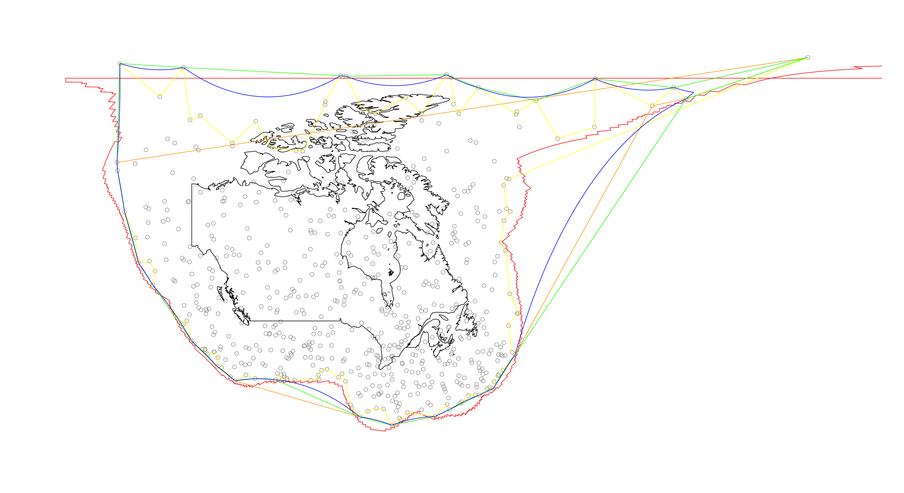
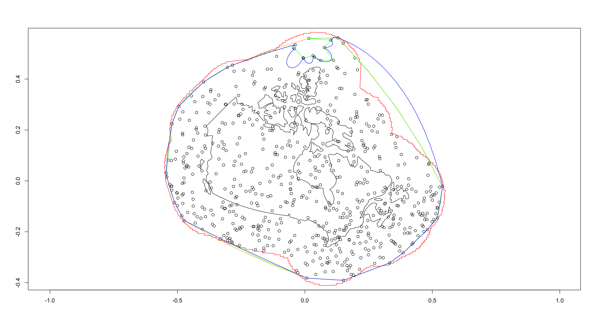
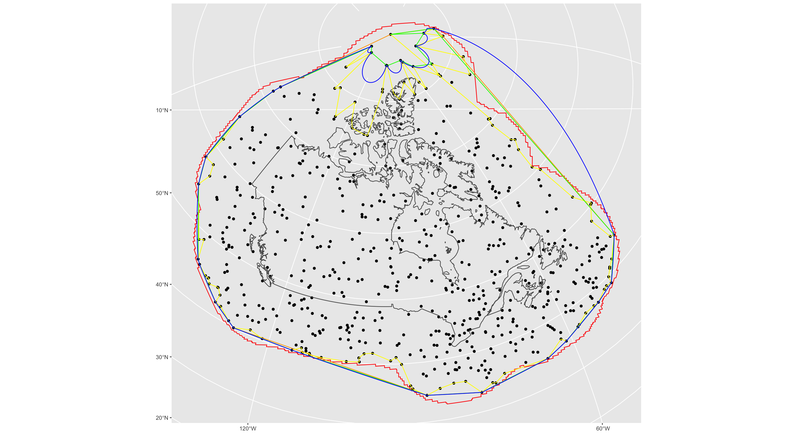
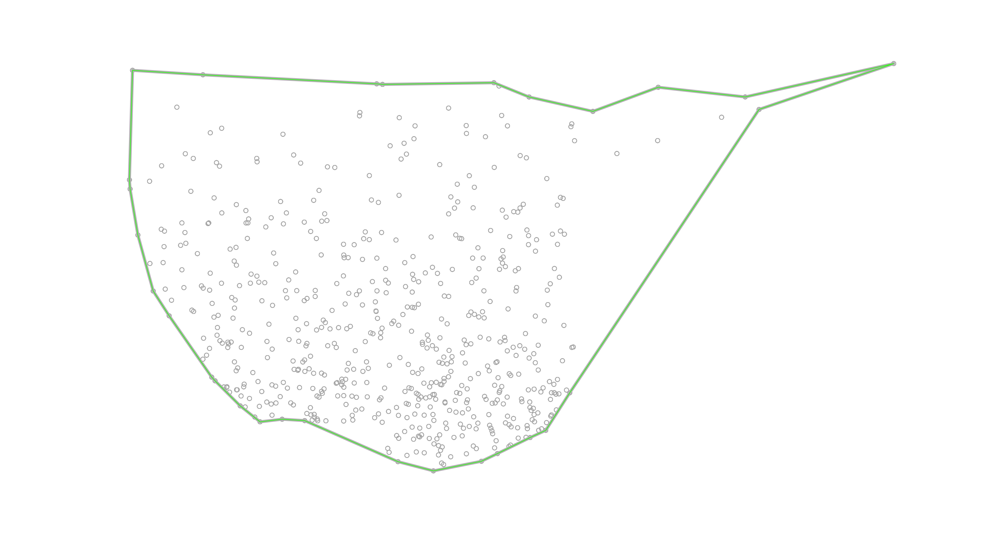
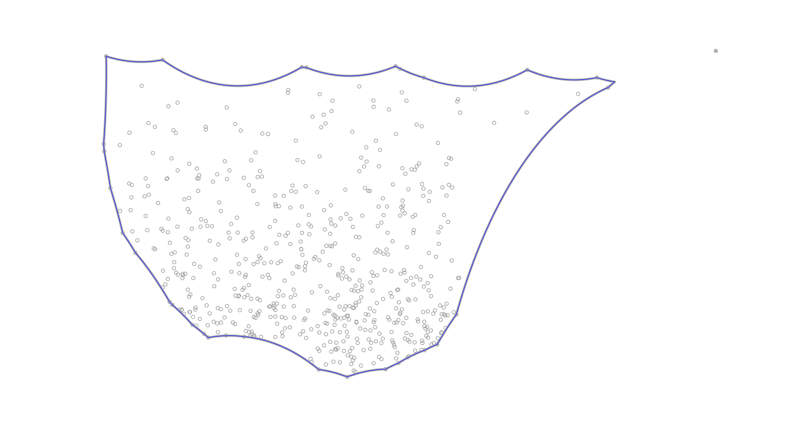

# R Spatial Borders

Examples of using various geometric border methods within the [#rspatial](https://twitter.com/hashtag/rspatial) ecosystem 

``` r
library(s2)
library(sf)
library(concaveman)
library(alphahull)
library(dplyr)
library(sp)
library(ggplot2)
library(igraph)
source('utils/alphahullsfsp.R')
```

# Spatial Objects

## s2 objects

``` r
n <- 1e4
canada_s2 <- s2_data_countries("Canada")
points_s2 <- s2_point(runif(n, -1, 1), runif(n, -1, 1), runif(n, -1, 1))
geog_s2 <- as_s2_geography(as_s2_lnglat(points_s2))
```

## sf objects

``` r
d_sf_ne <- rnaturalearth::ne_countries(scale = 50, returnclass = "sf")
d_canada_sf <- d_sf_ne |> filter(geounit == "Canada")
# points 100km outside of Canada border
i_100km <-s2_prepared_dwithin(geog_s2, canada_s2, distance = 1e6)
d_geog_sf <- geog_s2[i_100km] |> st_as_sf()
```

# boundaries outside of points

## convex hull s2

``` r
wk_convexhull_s2 <- s2_convex_hull_agg(points_s2[i_100km])
```

## convex hull s2 to sf

``` r
convexhull_s2_sf <- st_as_sf(wk_convexhull_s2)
```

## concave concaveman sf

``` r
concave_sf <- concaveman(d_geog_sf)
# does not do anything :/ - edges still cross
sf_use_s2(FALSE)
```

    ## Spherical geometry (s2) switched off

``` r
concave_sf <- st_make_valid(concave_sf)
sf_use_s2(TRUE)
```

    ## Spherical geometry (s2) switched on

## concave concaveman sf to s2

``` r
# does not work when edges cross 
# concave_sf_s2 <- st_as_s2(concave_sf)
```

## buffer sf

``` r
d_canada_buf_sf <- d_canada_sf %>% st_buffer(dist = 1e6)
```

## buffer sf to s2

``` r
canada_buf_sf_s2 <- st_as_s2(d_canada_buf_sf)
```

## concave alpha hull - shapes (straight edges)

``` r
# not entirely sure if alphahull relies on random number generation & compute
# changing the alpha parameter is indeed inconsistent though across different computers 
# & also within long running sessions on the same computer 
# so trying to set seed for some reproducibility here - but unsure if it helps at all
set.seed(080522)
# alpha = 25 loses 1 point - 60 captures it visually as a polygon
# alpha_shape <- ashape(st_coordinates(d_geog_sf), alpha = 25)
alpha_shape <- ashape(st_coordinates(d_geog_sf), alpha = 60)
alpha_shape_sf <- ashape2poly(alpha_shape, type = "sf", crs = 4326)
alpha_shape_sf_s2 <- st_as_s2(alpha_shape_sf)
```

## concave alpha hull - arcs/hulls (curved edges)

``` r
# alpha = 80 loses 1 points - 770 captures it visually as a polygon
alpha_hull <- ahull(st_coordinates(d_geog_sf), alpha = 80)
alpha_hull_sf <- ahull2poly(alpha_hull, type = "sf", crs = 4326)
alpha_hull_sf_s2 <- st_as_s2(alpha_hull_sf)
```

# plot points within 100km of Canada & Draw Geometric Borders

## regular plot

``` r
sf:::plot.sf(d_geog_sf, col = "darkgrey")
plot(d_canada_sf$geometry, border = "black", col = NA, add = TRUE)
plot(d_canada_buf_sf$geometry, border = "red", col = NA, add = TRUE)
sf:::plot.sf(convexhull_s2_sf, border = "orange", add = TRUE)
sf:::plot.sf(concave_sf, border = "yellow", add = TRUE)
sf:::plot.sf(alpha_shape_sf, border = "green", add = TRUE)
sf:::plot.sf(alpha_hull_sf, border = "blue", add = TRUE)
```

<!-- -->

## original s2 plot

``` r
s2_plot(points_s2[i_100km])
s2_plot(canada_s2, border = "black", add = TRUE)
s2_plot(canada_buf_sf_s2, add = TRUE, border = "red")
s2_plot(wk_convexhull_s2, border = "orange", add = TRUE)
s2_plot(alpha_shape_sf_s2, border = "green", add = TRUE)
s2_plot(alpha_hull_sf_s2, border = "blue", add = TRUE)
```

<!-- -->

## sf ggplot

``` r
coords <- st_coordinates(st_centroid(d_canada_sf))
x <- coords[, 'X']
y <- coords[, 'Y']
ggplot() +
  geom_sf(data = d_geog_sf) + # points
  geom_sf(data = d_canada_sf, fill = "transparent") + # Canada
  geom_sf(data = d_canada_buf_sf, fill = "transparent", color = "red") + # 100km buffer
  geom_sf(data = convexhull_s2_sf, fill = "transparent", color = "orange") + # s2 convex hull
  geom_sf(data = concave_sf, fill = "transparent", color = "yellow") + # concaveman
  geom_sf(data = alpha_shape_sf, fill = "transparent", color = "green") + # alpha hull concave shape
  geom_sf(data = alpha_hull_sf, fill = "transparent", color = "blue") + # alpha hull concave hull
  coord_sf(crs = paste0("+proj=ortho +lat_0=", y, " +lon_0=", x)) # orthographic projection & center
```

<!-- -->

## alphahull plot

### alpha shape

``` r
plot(d_geog_sf)
plot(alpha_shape, lwd = 5, col = "gray", add = TRUE)
plot(alpha_shape_sf, border = "green", add = TRUE)
```

<!-- -->

### alpha hull arcs

``` r
plot(d_geog_sf)
plot(alpha_hull, lwd = 5, col = "gray", add = TRUE)
plot(alpha_hull_sf, border = "blue", add = TRUE)
```

<!-- -->
